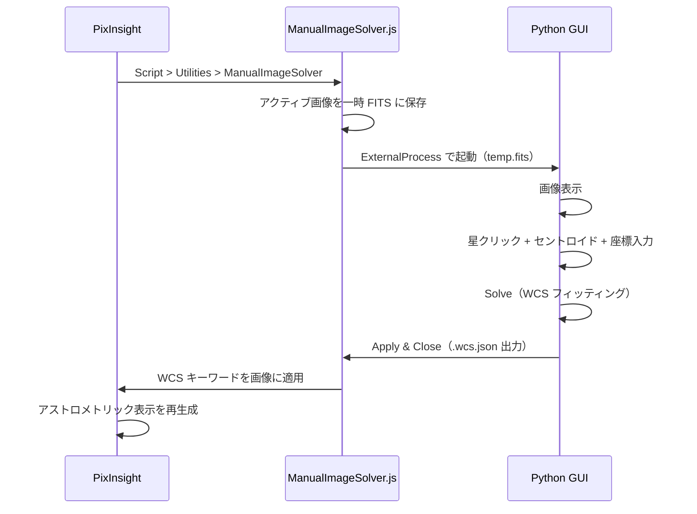
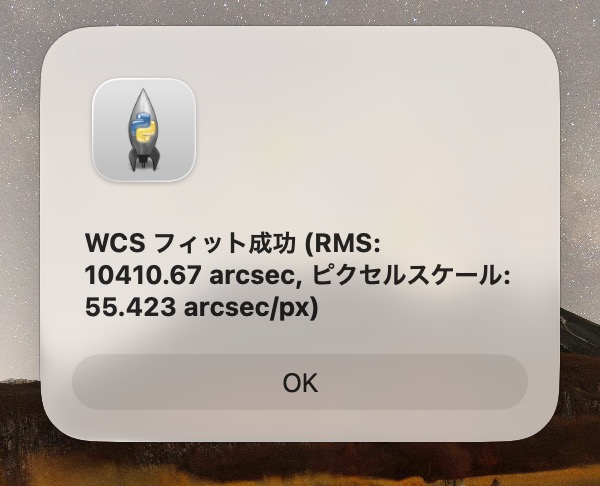
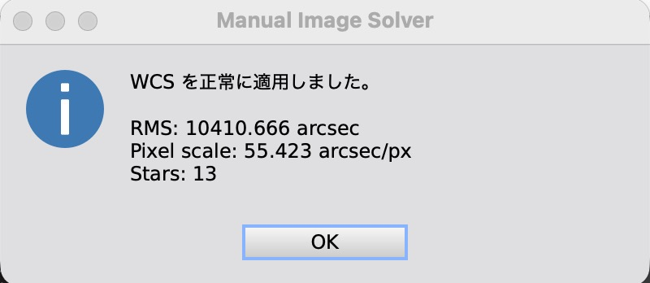

# Manual Image Solver

手動プレートソルブツール。画像上の星をユーザーが手動で同定し、TAN（gnomonic）投影の WCS（World Coordinate System）を算出して画像に適用します。

## 概要

astrometry.net や PixInsight の ImageSolver による自動プレートソルブが失敗する画像に対し、手動で星を同定して WCS を取得するためのツールです。

**PixInsight 完結ワークフロー**: PixInsight のスクリプトメニューから起動するだけで、Python GUI による星の手動選択から WCS 適用まで一気通貫で完了します。



## インストール

セットアップの詳細は [docs/setup.md](docs/setup.md) を参照してください。

### クイックスタート

```bash
cd manual-image-solver

# 仮想環境作成 + 依存パッケージインストール
python3 -m venv .venv
source .venv/bin/activate
pip install -r requirements.txt
```

PixInsight へのスクリプト登録:
1. **Script > Feature Scripts...** を開く
2. **Add** → `manual-image-solver/javascript/` ディレクトリを選択
3. **Done** で閉じる → **Script > Utilities > ManualImageSolver** がメニューに追加される

## 使い方

### 1. スクリプトを起動する

PixInsight で対象画像を開き、**Script > Utilities > ManualImageSolver** を実行します。

初回のみ Python パスと manual-image-solver ディレクトリの設定ダイアログが表示されます（次回以降は自動読み込み）。

Python GUI が自動起動し、画像が表示されます。


### 2. 星を登録する

画像上の星をクリックすると、セントロイド計算で星の中心に自動スナップし、座標入力ダイアログが開きます。

**天体名**を入力して **Search** をクリックすると、CDS Sesame データベースから RA/DEC が自動入力されます。RA/DEC を直接入力することもできます。


#### 座標入力フォーマット

| 項目 | フォーマット例 |
|---|---|
| RA（HMS） | `05 14 32.27` / `05:14:32.27` |
| RA（度数） | `78.634` |
| DEC（DMS） | `+07 24 25.4` / `-08:12:05.9` |
| DEC（度数） | `7.407` / `-8.202` |

### 3. Solve を実行する

4 星以上を登録したら **Solve** ボタンをクリックします。WCS フィッティングが実行され、各星の残差が表示されます。


### 4. WCS を適用する

**Apply & Close** をクリックすると、WCS が JSON ファイルとして出力され、Python GUI が終了します。



PixInsight 側で JSON が自動的に読み込まれ、WCS がアクティブ画像に適用されます。



Process Console にはフィット結果の詳細（各星の残差、画像四隅の座標、FOV、回転角度など）が表示されます。


### 5. 結果を確認する

WCS 適用後、PixInsight の **AnnotateImage** で星座や天体のアノテーションを重ねて確認できます。


### セッションの復元

前回の星ペア情報がある場合、起動時に復元するか選択できます。


### Python GUI 単体利用

PixInsight なしでスタンドアロンでも利用できます。

```bash
# GUI 起動
.venv/bin/python python/main.py

# 画像ファイルを指定して起動
.venv/bin/python python/main.py --input /path/to/image.fits
```

スタンドアロンモードでは **Export JSON** / **Write FITS** ボタンが表示されます。

### WCSApplier.js（手動 JSON 適用）

JSON ファイルから WCS を手動適用する場合:
1. PixInsight で対象画像を開く
2. **Script > Run Script File...** → `javascript/WCSApplier.js`
3. JSON ファイルを選択 → WCS が画像に適用される

## プロジェクト構成

```
manual-image-solver/
├── python/
│   ├── main.py                    # CLI エントリーポイント（--input, --output 対応）
│   ├── gui/
│   │   ├── main_window.py         # PyQt6 QMainWindow
│   │   ├── image_viewer.py        # matplotlib 画像ビューア
│   │   ├── star_table.py          # 星テーブル（QTableWidget）
│   │   └── star_dialog.py         # 星座標入力ダイアログ
│   ├── core/
│   │   ├── wcs_math.py            # TAN投影、WCSFitter
│   │   ├── centroid.py            # セントロイド計算
│   │   ├── image_loader.py        # FITS/XISF 読み込み
│   │   ├── auto_stretch.py        # ZScale+AsinhStretch
│   │   └── sesame_resolver.py     # CDS Sesame 天体名検索
│   └── wcs_io/
│       └── wcs_json.py            # PJSR互換 JSON 入出力
├── javascript/
│   ├── ManualImageSolver.js       # PJSR メイン（ExternalProcess で Python GUI 起動 → WCS 自動適用）
│   ├── WCSApplier.js              # スタンドアロン JSON → WCS 適用
│   └── wcs_math.js                # WCS 数学関数（JS版）
├── tests/
│   ├── python/                    # pytest（36テスト）
│   └── javascript/                # Node.js 単体テスト + PJSR 統合テスト
├── docs/
│   ├── setup.md                   # セットアップガイド
│   ├── specs.md                   # 技術仕様書
│   ├── tests.md                   # テスト手順書
│   └── images/                    # スクリーンショット
├── requirements.txt
└── .gitignore
```

## テスト

```bash
# Python 全テスト実行
PYTHONPATH="python" .venv/bin/pytest tests/python -v

# Node.js 単体テスト
node tests/javascript/test_wcs_math.js
```

PJSR 統合テスト: PixInsight で **Script > Run Script File...** → `tests/javascript/ManualSolverTest.js`

## 技術詳細

- **投影方式**: TAN（gnomonic）投影
- **フィッティング**: CD行列の線形最小二乗法（クレーメルの公式）
- **CRVAL 決定**: 星の天球座標重心から反復更新（5回）
- **セントロイド**: 輝度重心法（バックグラウンド中央値差し引き）
- **座標系**: PixInsight ピクセル（0-based, y=0 が上端）→ 標準 FITS（1-based, y=1 が下端）変換
- **オートストレッチ**: astropy ZScale + AsinhStretch

詳細は [docs/specs.md](docs/specs.md) を参照。

## 配布方法について

本ツールは PixInsight の[アップデートリポジトリ](https://pixinsight.com/doc/docs/PIRepositoryReference/PIRepositoryReference.html)による配布を検討しましたが、以下の理由により GitHub での配布としています。

- **PJSR の制約**: PixInsight の PJSR スクリプトは実行中コンソールがモーダルになるため、画像上で星をクリックして選択するインタラクティブな操作ができません。そのため Python GUI（PyQt6 + matplotlib）を外部プロセスとして起動する設計を採用しています。
- **外部依存の問題**: PixInsight のアップデートリポジトリは PJSR スクリプトやネイティブモジュールの配布を想定しており、Python 環境を内包する仕組みがありません。
- **ネイティブモジュール化の断念**: C++/PCL の `ProcessInterface` として実装すれば画像上でのインタラクティブ操作が可能になり、リポジトリ配布もできますが、macOS / Linux / Windows の 3 プラットフォーム分のビルド環境が必要となるため、現時点では対応が困難です。

そのため、本リポジトリを clone し、セットアップ手順に従って Python 環境を構築していただく形での利用をお願いしています。

## ライセンス

Copyright (c) 2024-2025 Split Image Solver Project
