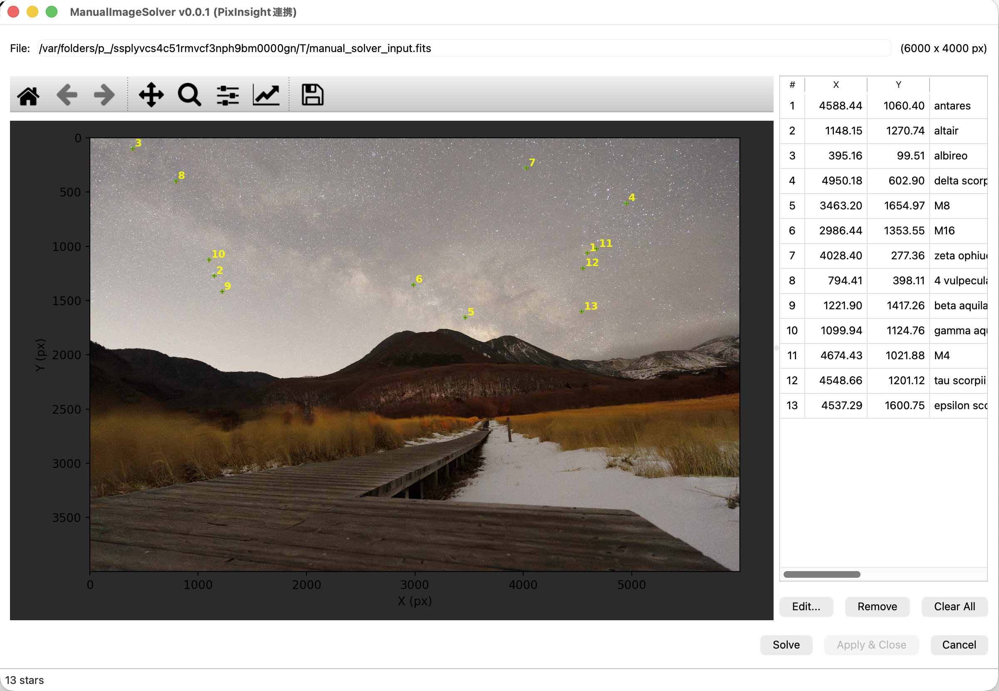
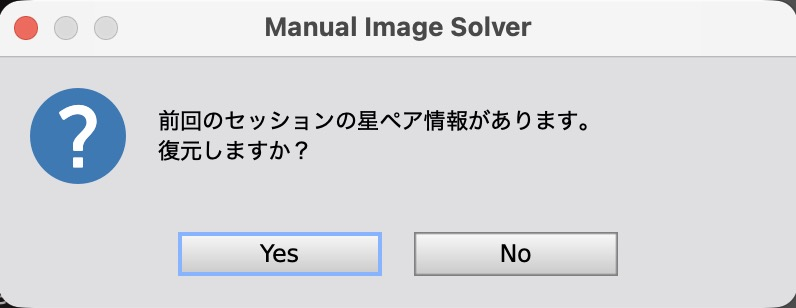
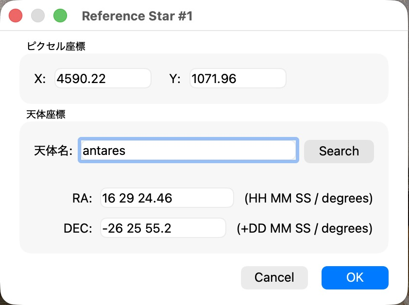
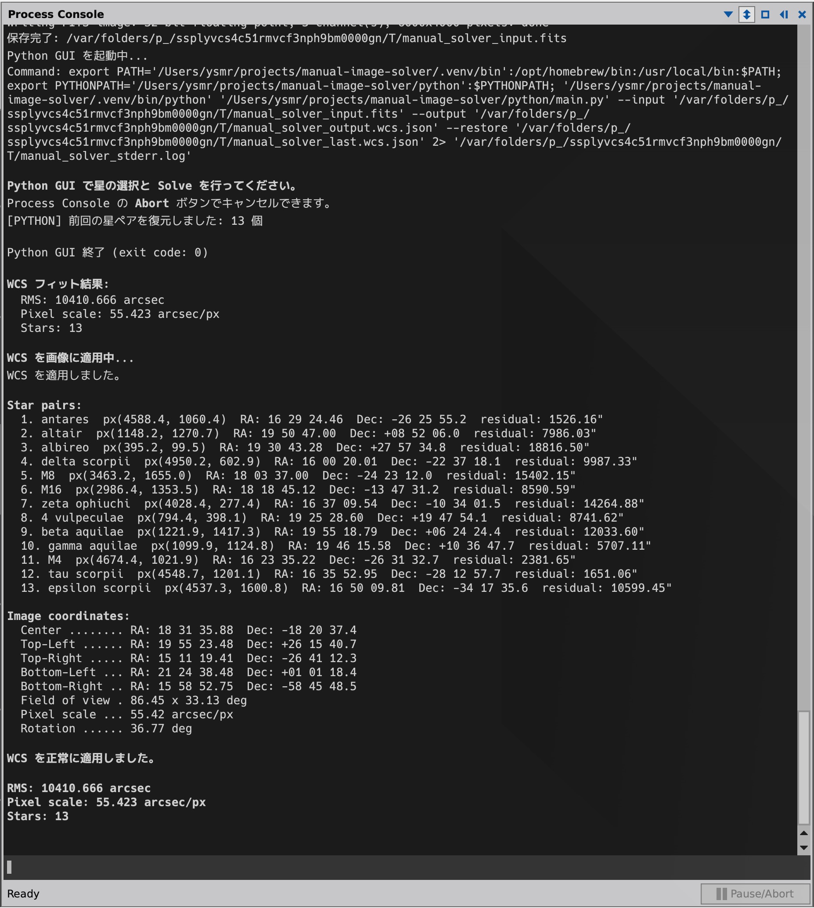
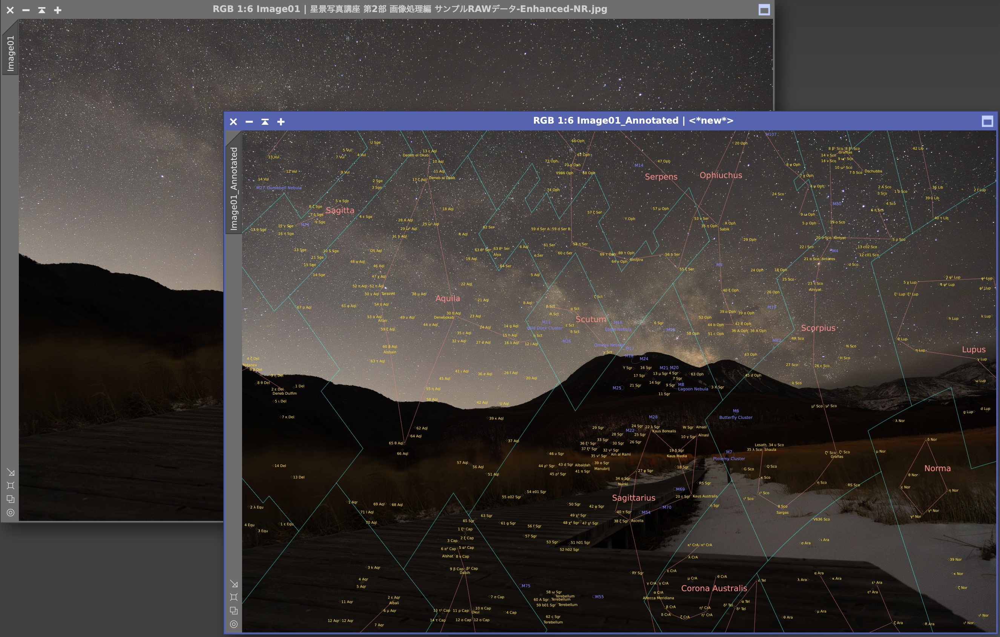

[日本語](README.ja.md)

# Manual Image Solver v1.2.1

A manual plate solving tool for PixInsight. Manually identify stars on an image to compute and apply a TAN (gnomonic) projection WCS (World Coordinate System).

## Overview

When automatic plate solving with astrometry.net or PixInsight's ImageSolver fails, this tool lets you manually identify stars to obtain a WCS solution.

**Runs entirely within PixInsight**: No external dependencies like Python required. All operations — image display, star selection, WCS fitting, and application — are performed within a native PJSR Dialog.



## Features

- **Intuitive controls**: Click to select stars, drag to pan (no mode switching needed)
- **Stretch modes**: Switch between None / Linked / Unlinked with one click
- **19-level zoom**: Mouse wheel (centered on cursor), Fit / 1:1 buttons, +/- buttons
- **Display rotation**: Rotate the preview by 90°/180°/270° CW/CCW for portrait images (coordinates are handled correctly)
- **Sortable star table**: RA and DEC in separate columns, click headers to sort — makes it easy to spot misidentified stars
- **Circumpolar support**: 3D unit vector mean for CRVAL estimation correctly handles images including the celestial pole
- **Session restore**: Star pair data is auto-saved and can be restored on next launch
- **Export / Import**: Save and load star pair data as JSON files
- **Sesame search**: Auto-resolve RA/DEC from object names via the CDS Sesame database
- **Centroid calculation**: Auto-snap to star centers using intensity-weighted centroid

## Installation

### From Repository (Recommended)

1. In PixInsight, go to **Resources > Updates > Manage Repositories**
2. Click **Add** and enter the following URL:
   ```
   https://raw.githubusercontent.com/ysmr3104/manual-image-solver/main/repository/
   ```
3. Click **OK**, then run **Resources > Updates > Check for Updates**
4. Restart PixInsight

### Manual Installation

1. Clone or download this repository
2. In PixInsight, open **Script > Feature Scripts...**
3. Click **Add** and select the `manual-image-solver/javascript/` directory
4. Click **Done** — **Script > Utilities > ManualImageSolver** will appear in the menu

No Python or external packages required.

## Usage

### 1. Launch the Script

Open the target image in PixInsight and run **Script > Utilities > ManualImageSolver**.

The dialog opens with a stretched preview of the image.


If session data from a previous run exists, a dialog will ask whether to restore it.



### 2. Register Stars

**Click** on a star in the image. The centroid algorithm auto-snaps to the star center, and a coordinate input dialog opens.



Enter an **object name** and click **Search** to auto-fill RA/DEC from the CDS Sesame database. You can also enter RA/DEC directly.

#### Coordinate Input Formats

| Field | Format Examples |
|---|---|
| RA (HMS) | `05 14 32.27` / `05:14:32.27` |
| RA (degrees) | `78.634` |
| DEC (DMS) | `+07 24 25.4` / `-08:12:05.9` |
| DEC (degrees) | `7.407` / `-8.202` |

### 3. Run Solve

Once 4 or more stars are registered, click the **Solve** button. WCS fitting is performed and residuals for each star are displayed.

### 4. Apply WCS

Click **Apply to Image** to write the WCS directly to the active image.

The Process Console displays fit details including per-star residuals, corner coordinates, FOV, and rotation angle.



### 5. Verify Results

After WCS application, use PixInsight's **AnnotateImage** to overlay constellation lines and object annotations for verification.



### Tips

- **Star selection**: Click on the image (auto-snaps via centroid)
- **Pan**: Left-button drag or middle-button drag
- **Zoom**: Mouse wheel (centered on cursor position)
- **Zoom buttons**: Fit (fit to window), 1:1 (actual size), + (zoom in), - (zoom out)
- **Rotation**: ↺ / ↻ buttons to rotate the display (useful for portrait images)
- **Stretch toggle**: STF: None / Linked / Unlinked buttons in toolbar (active mode shown with ▶ marker)
- **Edit stars**: Double-click a table row, or select and click **Edit...**
- **Remove stars**: Select and click **Remove**
- **Export / Import**: Save and load star pair data as JSON files

### WCSApplier.js (Manual JSON Application)

To manually apply WCS from a JSON file:
1. Open the target image in PixInsight
2. **Script > Run Script File...** → select `javascript/WCSApplier.js`
3. Select the JSON file → WCS is applied to the image

## Technical Details

See [docs/specs.md](docs/specs.md) for the full technical specification.

## License

This project is licensed under the [MIT License](LICENSE).
