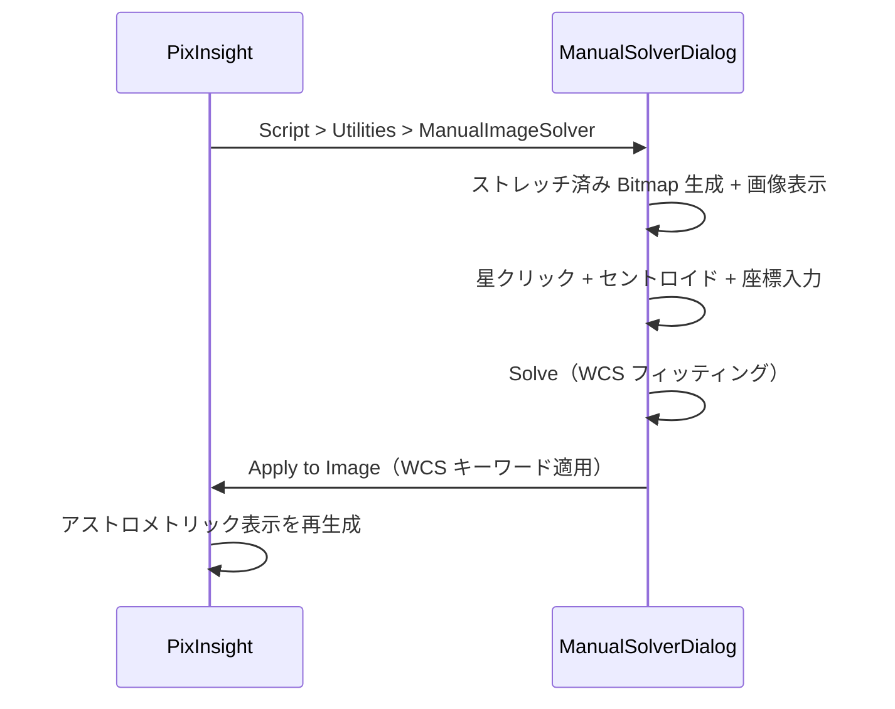

# Manual Image Solver

手動プレートソルブツール。画像上の星をユーザーが手動で同定し、TAN（gnomonic）投影の WCS（World Coordinate System）を算出して画像に適用します。

## 概要

astrometry.net や PixInsight の ImageSolver による自動プレートソルブが失敗する画像に対し、手動で星を同定して WCS を取得するためのツールです。

**PixInsight 完結**: Python 等の外部依存なし。PixInsight の PJSR ネイティブ Dialog 内で、画像表示から星選択、WCS フィッティング、適用まで全ての操作が完結します。



## インストール

1. このリポジトリを clone またはダウンロード
2. PixInsight で **Script > Feature Scripts...** を開く
3. **Add** → `manual-image-solver/javascript/` ディレクトリを選択
4. **Done** で閉じる → **Script > Utilities > ManualImageSolver** がメニューに追加される

Python や外部パッケージのインストールは不要です。

## 使い方

### 1. スクリプトを起動する

PixInsight で対象画像を開き、**Script > Utilities > ManualImageSolver** を実行します。

ダイアログが開き、ストレッチ済みの画像が表示されます。

### 2. 星を登録する

**Select** モードで画像上の星をクリックすると、セントロイド計算で星の中心に自動スナップし、座標入力ダイアログが開きます。

**天体名**を入力して **Search** をクリックすると、CDS Sesame データベースから RA/DEC が自動入力されます。RA/DEC を直接入力することもできます。

#### 座標入力フォーマット

| 項目 | フォーマット例 |
|---|---|
| RA（HMS） | `05 14 32.27` / `05:14:32.27` |
| RA（度数） | `78.634` |
| DEC（DMS） | `+07 24 25.4` / `-08:12:05.9` |
| DEC（度数） | `7.407` / `-8.202` |

### 3. Solve を実行する

4 星以上を登録したら **Solve** ボタンをクリックします。WCS フィッティングが実行され、各星の残差が表示されます。

### 4. WCS を適用する

**Apply to Image** をクリックすると、WCS がアクティブ画像に直接適用されます。

Process Console にはフィット結果の詳細（各星の残差、画像四隅の座標、FOV、回転角度など）が表示されます。

### 5. 結果を確認する

WCS 適用後、PixInsight の **AnnotateImage** で星座や天体のアノテーションを重ねて確認できます。

### 操作ヒント

- **ズーム**: マウスホイール、またはツールバーの Zoom In / Zoom Out
- **パン**: **Pan** モードでドラッグ、または中ボタンドラッグ（Select モード中も可）
- **Fit**: ツールバーの Fit ボタンでウィンドウにフィット
- **星の編集**: テーブル行をダブルクリック、または選択して **Edit...** ボタン
- **星の削除**: 選択して **Remove** ボタン

### WCSApplier.js（手動 JSON 適用）

JSON ファイルから WCS を手動適用する場合:
1. PixInsight で対象画像を開く
2. **Script > Run Script File...** → `javascript/WCSApplier.js`
3. JSON ファイルを選択 → WCS が画像に適用される

## プロジェクト構成

```
manual-image-solver/
├── javascript/
│   ├── ManualImageSolver.js       # PJSR メイン（ネイティブ Dialog で全操作完結）
│   ├── WCSApplier.js              # スタンドアロン JSON → WCS 適用
│   └── wcs_math.js                # WCS 数学関数（PJSR + Node.js 両対応）
├── tests/
│   └── javascript/
│       ├── test_wcs_math.js       # Node.js 単体テスト（WCS 数学関数）
│       ├── test_parse_coords.js   # Node.js 単体テスト（座標パース + MTF）
│       └── ManualSolverTest.js    # PJSR 統合テスト
├── docs/
│   ├── setup.md                   # セットアップガイド
│   ├── specs.md                   # 技術仕様書
│   ├── tests.md                   # テスト手順書
│   └── images/                    # スクリーンショット
└── .gitignore
```

## テスト

```bash
# Node.js 単体テスト（WCS 数学関数）
node tests/javascript/test_wcs_math.js

# Node.js 単体テスト（座標パース + MTF）
node tests/javascript/test_parse_coords.js
```

PJSR 統合テスト: PixInsight で **Script > Run Script File...** → `tests/javascript/ManualSolverTest.js`

## 技術詳細

- **投影方式**: TAN（gnomonic）投影
- **フィッティング**: CD行列の線形最小二乗法（クレーメルの公式）
- **CRVAL 決定**: 星の天球座標重心から反復更新（5回）
- **セントロイド**: 輝度重心法（バックグラウンド中央値差し引き）
- **座標系**: PixInsight ピクセル（0-based, y=0 が上端）→ 標準 FITS（1-based, y=1 が下端）変換
- **オートストレッチ**: median + MAD ベースの STF → MTF（中間調転送関数）

詳細は [docs/specs.md](docs/specs.md) を参照。

## ライセンス

Copyright (c) 2024-2026 Manual Image Solver Project
